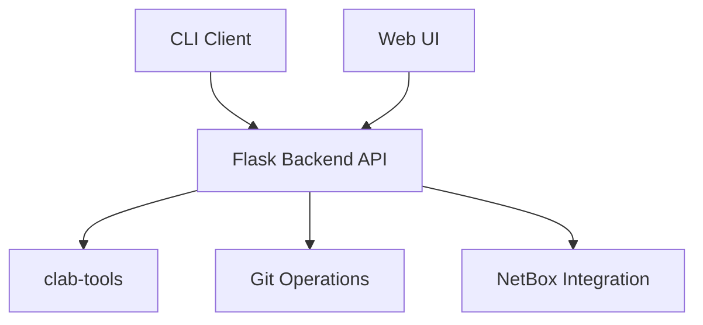
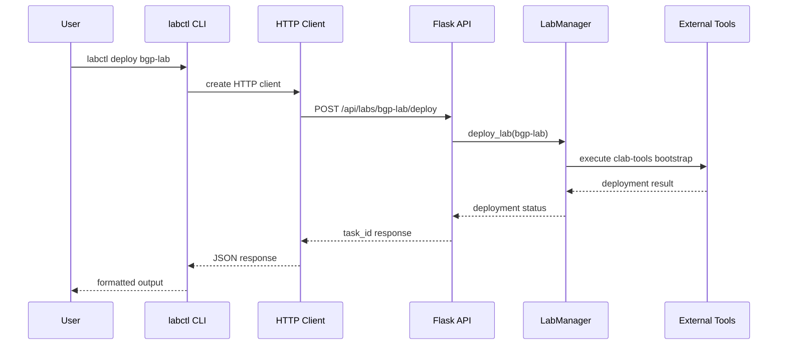
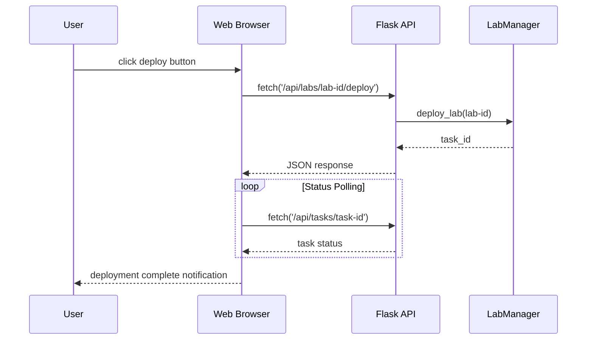
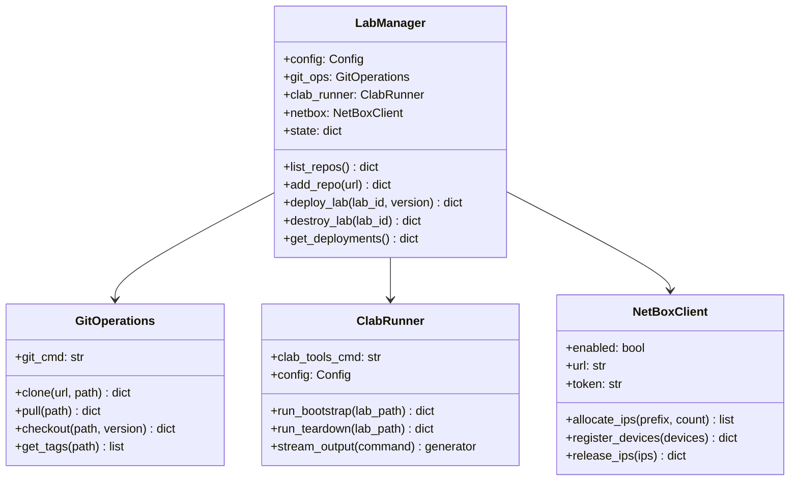
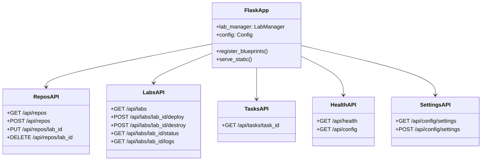
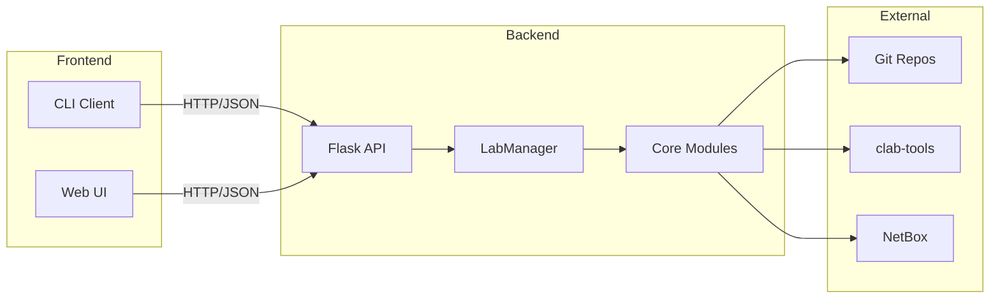
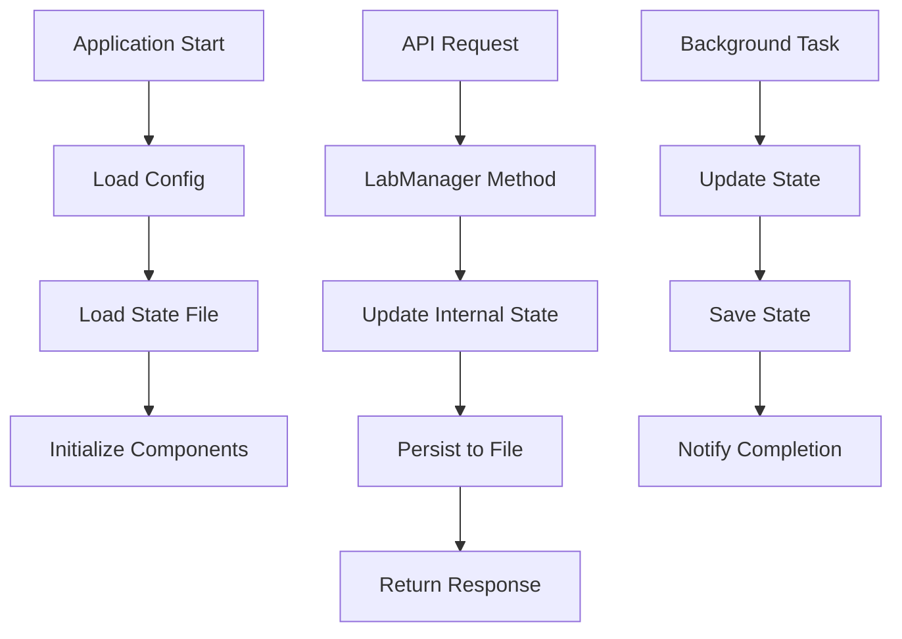

# Project Architecture

## Overview

Homelab Manager is an API-first lab management system with three main components:



## Directory Structure

### Frontend Components Tree

```
src/
├── cli/                    # CLI Client (Python)
│   ├── main.py            # Entry point & command registration
│   ├── client.py          # HTTP API client
│   ├── commands/          # Command implementations
│   │   ├── repo.py       # Repository management commands
│   │   ├── lab.py        # Lab deployment commands (deploy, destroy, status, logs)
│   │   ├── device_config.py # Configuration scenarios
│   │   └── system.py     # System commands (doctor, version, netbox)
│   └── utils/            # CLI utilities
└── web/                  # Web UI (HTML/CSS/JS)
    └── static/
        ├── js/
        │   ├── api.js    # API client functions
        │   ├── app.js    # Main application logic
        │   ├── ui.js     # UI helper functions
        │   └── settings.js # Settings page logic
        ├── css/          # Stylesheets
        ├── index.html    # Main dashboard
        └── settings.html # Settings page
```

### Backend Components Tree

```
src/backend/
├── app.py                 # Flask application & static file serving
├── api/                   # REST API endpoints
│   ├── repos.py          # Repository management endpoints
│   ├── labs.py           # Lab deployment endpoints
│   ├── tasks.py          # Async task tracking endpoints
│   ├── health.py         # Health check endpoints
│   └── settings.py       # Configuration management endpoints
├── core/                  # Business logic modules
│   ├── lab_manager.py    # Main orchestration class
│   ├── git_ops.py        # Git repository operations
│   ├── clab_runner.py    # clab-tools integration & execution
│   └── config.py         # Configuration management
├── integrations/          # External system integrations
│   └── netbox.py         # NetBox IP management
└── utils/                 # Shared utilities
    ├── validators.py     # Input validation
    └── helpers.py        # Common helper functions
```

## Code Flow Diagrams

### CLI Command Flow



### Web UI Flow



### Backend Processing Flow

```mermaid
graph TD
    A[API Request] --> B{Validate Input}
    B -->|Invalid| C[Return 400 Error]
    B -->|Valid| D[LabManager.method()]
    D --> E{Check Prerequisites}
    E -->|Missing| F[Return Error]
    E -->|OK| G[Execute Operation]
    G --> H{Operation Type}
    H -->|Git| I[GitOps.method()]
    H -->|Deploy| J[ClabRunner.run()]
    H -->|NetBox| K[NetBox.allocate()]
    I --> L[Return Result]
    J --> L
    K --> L
    L --> M[Format Response]
    M --> N[Return JSON]
```

## Class Relationships

### Core Module UML



### API Module Structure



## Data Flow Patterns

### Repository Management Flow

```mermaid
graph TD
    A[Add Repository Request] --> B[Validate Git URL]
    B --> C[GitOps.clone()]
    C --> D[Read lab-metadata.yaml]
    D --> E[Parse Lab Information]
    E --> F[Update State File]
    F --> G[Return Lab Info]
    
    H[Update Repository] --> I[GitOps.pull()]
    I --> J[GitOps.get_tags()]
    J --> K[Update Metadata]
    K --> L[Return Changes]
```

### Lab Deployment Flow

```mermaid
graph TD
    A[Deploy Request] --> B[Validate Lab Exists]
    B --> C[Check Version/Tag]
    C --> D[GitOps.checkout()]
    D --> E{NetBox Enabled?}
    E -->|Yes| F[NetBox.allocate_ips()]
    E -->|No| G[Use Static IPs]
    F --> H[Update nodes.csv]
    G --> H
    H --> I[ClabRunner.run_bootstrap()]
    I --> J[Monitor Process]
    J --> K[Update Deployment State]
    K --> L[Return Success]
    
    M[Error] --> N[Cleanup Resources]
    N --> O[Return Error]
```

## Component Interactions

### Frontend-Backend Communication



### State Management



## Technology Stack

### Backend Stack
- **Flask**: Web framework and API server
- **Requests**: HTTP client for external APIs
- **GitPython**: Alternative Git operations
- **pynetbox**: NetBox API client
- **subprocess**: External tool execution

### Frontend Stack
- **Click**: CLI framework
- **Rich**: Terminal formatting and UI
- **Vanilla JavaScript**: Web UI (no frameworks)
- **Fetch API**: HTTP client for web UI

### External Integrations
- **Git**: Repository management
- **clab-tools**: Containerlab deployment
- **NetBox**: IP address management
- **SSH**: Remote execution capabilities

## Key Design Patterns

1. **API-First Architecture**: All functionality exposed via REST API
2. **Command Pattern**: CLI commands as discrete operations
3. **Factory Pattern**: LabManager orchestrates all operations
4. **Observer Pattern**: Task status polling for async operations
5. **Strategy Pattern**: Different deployment strategies (local/remote)

This architecture provides a clean separation of concerns, making the system maintainable and extensible for future enhancements.